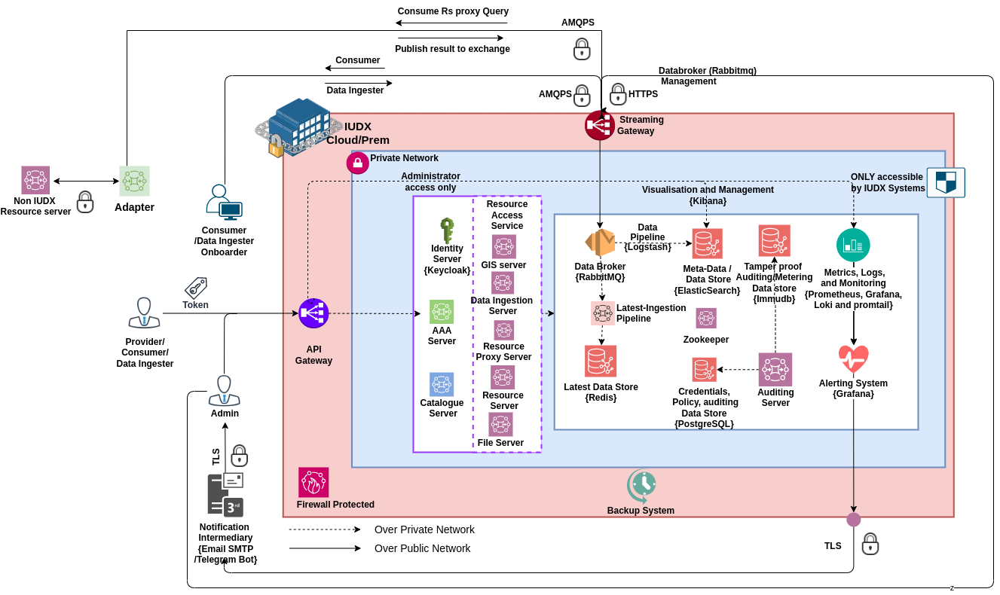
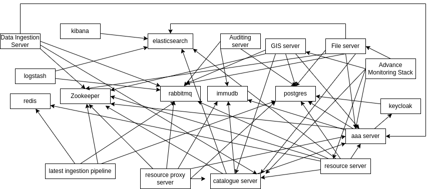

# IUDX Overview
The IUDX platform consists of various IUDX-built services and open-source components. The overview IUDX platform with components is shown in the below figure.

 
*
The above diagram depicts the overview of the complete IUDX system in a Docker Swarm environment
*

- IUDX Catalogue server - where a consumer discovers different datasets available . 

- AAA server - where a user (consumer/provider,data ingester/delegate) can get set/request policies, and get a token. 

- Use the token to publish/consume the data from resource server if the data resides in IUDX or through resource server proxy and adapter in front of the data sources. 

- IUDX platform supports following input  data flows

  - A data ingester ( delegate ) can push the data from the downstream source (ICCC) to databroker (Rabbitmq) . Which then is consumed by Logstash, latest ingestion pipeline and push it to the MetaData/Data Store (Elasticsearch) and Latest Data store (Redis).

- IUDX platform supports following output data flows

  - Get data through standardised Resource server APIs

  - Get live streaming data through Rabbitmq using resource server Subscription

  - An adapter can reside near the data source, and the queries made through the resource proxy server are passed through Rabbitmq to the adapter . The adapter in turn queries the datasource and pushes the results back into rabbitmq and resource proxy server consumes from Rabbitmq and sends back to user

- IUDX AAA platform manages the identities of users throughKeycloak- IUDX AAA platform manages the policies, APDs through credentials/Policy Data store

- IUDX platform is monitored through micrometer, prometheus for metrics and promtail, Loki for logs and Grafana for Visualisation and email alerting through SMTP server

- All HTTPS request are processed through  Nginx ingress with rate limiting set to protect against overwhelming of IUDX platform

- The Rabbitmq specific co communication i.e. streaming of data through AMQPS and HTTPS management interface 

- The IUDX platform uses custom scripts as backup system

- Please watch the videos

  - [What is IUDX?](https://youtu.be/uWdmHztFrqs) to get overview of IUDX

  - [IUDX Architecture Overview](https://www.youtube.com/watch?v=FeiZz0fJi5w) for deep drive of IUDX architectureGet more resources on IUDX at [IUDX Developer Section](https://iudx.org.in/developers/)

## dependency graph 

 

## Deployment Ordering

**Following is the deployment order, derived from the above dependency graph. It is grouped into stages, modules in a stage can be independently deployed.**

  **Stage 0 (Addons) :**  The components which are essential for IUDX components deployment (but not part of IUDX core), referred  to as addons.

  1. Nginx 

  2. Monitoring stack 

     1. Loki

     2. Promtail

     3. Node exporter

     4. Prometheus

     5. Grafana

  3. Backup Scripts

  1) Stage 1 

     1. Immudb

     2. Rabbitmq  

     3. Postgresql

     4. Redis

     5. Zookeeper

     6. Elasticsearch (Deploy ELK together)

  2) Stage 2  

     1. Logstash

     2. Kibana

     3. Keycloak

     4. Latest ingestion pipeline

     5. Auditing Server

  3) Stage 3

     1. AAA server

  4) Stage 4 

     1. Catalogue server

  5) Stage 5 

     1. Resource Server

     2. Resource Server Proxy

     3. File server

     4. GIS server

     5. Data Ingestion server

  6) Stage 6

     1. Advance Monitoring Stack

##  IUDX Component Version Matrix

                                                                                                                                           
| **Component**                   | **Image Version**                                                                                           |
| :---------------------------------:|:-------------------------------------------------------------------------------------------------------------:|
| Immudb                          | 1.4.1                                                                                                       |
| Rabbitmq                        | 3.11.10                                                                                                     |
| PostgreSQL                      | 14.4.0                                                                                                      |
| Redis                           | 7.0.2(redis)-2.0.9(rejson)                                                                                  |
| Zookeeper                       | 3.8.0                                                                                                       |
| Elasticsearch                   | 8.7.0                                                                                                       |
| Logstash                        | 8.7.0                                                                                                       |
| Kibana                          | 8.7.0                                                                                                       |
| Latest Ingestion Pipeline (LIP) | 4.5.0-8562630                                                                                               |
| Auditing server                 | 1.0.0-db57a99                                                                                               |
| AAA-server                      | 4.5.0-[aded501](https://github.com/orgs/datakaveri/packages/container/aaa-depl/96914619?tag=4.5.0-aded501)  |
| Catalogue API server            | 4.5.0-[c9d7598](https://github.com/orgs/datakaveri/packages/container/cat-prod/105131185?tag=4.5.0-c9d7598) |
| Resource API server             | 4.5.0-[b1b40d7](https://github.com/orgs/datakaveri/packages/container/rs-depl/104998888?tag=4.5.0-b1b40d7)  |
| File server                     | 4.5.0-b52a0ac                                                                                               |
| GIS server                      | 4.5.0-7be5bd7                                                                                               |
| Data Ingestion server           | 4.5.0-8298bde                                                                                               |
| Advance Monitoring Stack        | 4.0.0-2                                                                                                     |
-------------------------------------------------------------------------------------------------------------------------------------------------

